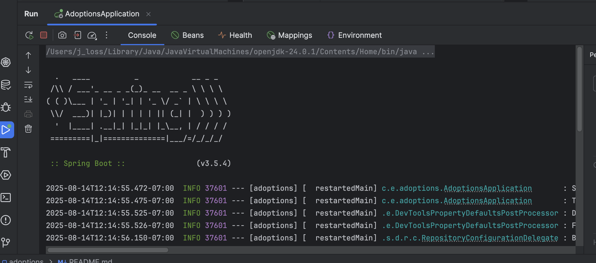

# Dog Adoptions Demo
Demo of Spring AI Agents, AWS Bedrock access with RAG, and MCP tools implementation. 
See [Inspiration](#inspiration) for the why and where of the adoption demo.

## Overview
Technologies Demonstrated:
* Spring AI- Java Chat Client and supporting classes
* MCP- Demonstrate tool registration, lookup, and implementation
* Vector Database- local docker vector database for RAG
* AWS Bedrock- Spring libraries and setup instructions

# Tech Requirements
* git and github access
* Docker install
* Java 24 or higher

# Install and Setup- IntelliJ

## 1. Pull Repository

### Select: New/Project from Version Control


### Enter URL: https://github.com/jeremyworks/ai-demo-adoptions
You may get asked about your github user and creds.


## 2. Start up Docker
You can open a terminal in IntelliJ to run this.

``docker compose up -d``

This will start a vector database and a temporary MCP service with
the demo scheduling tool enabled.

## 3. Setup Access Properties
``cp application-develop.properties.example application-develop.properties``

Edit application-develop.properties. Get these values from your AWS admin.
```
spring.ai.bedrock.aws.access-key=
spring.ai.bedrock.aws.secret-key=
```

## 4. Enable Develop Profile
### Select: Run / Edit Configurations


## 5. Run the App
### Select: Run / Springboot Adoptions Application


## 6. Run Requests
### Navigate to: client.http
Click on the **green arrow** next to the first request and wait for it to respond.

Then Run the second request that makes the appointment through MCP.


## Chat Client
You can also test using the page: http://localhost:8080/chat.html


## Inspiration
In this Video:

_**Wouldn't it be great if the code they were racing through were available?**_

_**Wouldn't it be great if the code they were typing actually worked?**_

https://youtu.be/Y291afdLroQ?si=Zf9xmzvE9C_0ZU1V

This video made it look ridiculously quick and easy to get a Spring AI Agent up and running.
It turns out not everything they showed on the screen actually works if you type it in.
I have worked out the kinks and recreated their demo with more of the dependencies covered.


